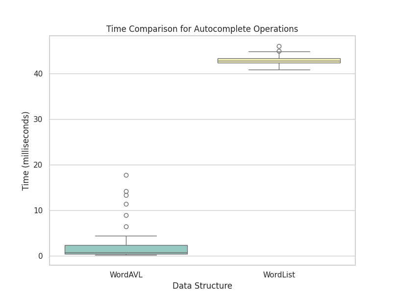

# Word AVL

Course: DCA0209

Student: João Pedro Freire Cabral

Repository link: https://github.com/jpfcabral/wordavl

## Introduction

This repository showcasing two fundamental data structures for prefix autocomplete: AVL tree and word list. Autocomplete is a vital feature in many applications, enhancing user experience by predicting and suggesting words or phrases as they type. In this repository, we present implementations of AVL tree and word list data structures tailored for efficient prefix autocomplete functionality. AVL trees offer a balanced binary search tree solution, ensuring fast retrieval of words based on prefixes. On the other hand, word lists provide a simple and intuitive approach, storing words sequentially. Through this repository, we aim to explore the strengths and weaknesses of these two approaches in the context of prefix autocomplete. By comparing their performance metrics such as search time, memory usage, and scalability, developers and enthusiasts can gain valuable insights into selecting the most suitable data structure for their specific applications. Whether you're diving into the world of data structures or seeking optimal solutions for prefix autocomplete, this repository serves as a comprehensive resource for exploration and experimentation.

## Corpus Loading

One notable distinction between AVL trees and word lists lies in their structure-building process. AVL trees require more time and computational resources during construction compared to word lists. This disparity stems from the inherent complexity of maintaining balance within AVL trees, ensuring that they adhere to the self-balancing property. As a result, AVL tree construction involves additional overhead to perform rotations and adjustments, aiming to maintain the tree's balance. In contrast, word lists are relatively straightforward to build, involving the sequential insertion of words without the need for balancing operations. While AVL trees prioritize balanced structure for efficient search operations, word lists prioritize simplicity and ease of construction. In this repository, we provide actual performance values illustrating the time discrepancy between AVL tree and word list construction, offering insights into their respective efficiency in building structures tailored for prefix autocomplete functionality. The table below shows the median value for reading approximately 260,000 different words found in the [Portuguese dictionary](https://www.ime.usp.br/~pf/dicios/br-utf8.txt)

| Data Structure | Median Time (Build Structure)     |
|----------------|-----------------------------------|
| AVL Tree       | 3.68 seconds |
| Word List      | 0.12 seconds |

## Prefix Search

In the subsequent phase of our analysis, we delve into the search step, a critical aspect of prefix autocomplete functionality. Here, we compare the efficiency of search operations between AVL trees and word lists. AVL trees, renowned for their balanced structure, offer logarithmic search time, ensuring rapid retrieval of words based on prefixes. In contrast, word lists, while simpler in structure, typically require linear search time, traversing each word sequentially to find matches. This comparison highlights a fundamental trade-off: AVL trees prioritize optimized search performance through balanced structure, whereas word lists prioritize simplicity and ease of implementation. By scrutinizing the performance metrics of both data structures during the search step, we aim to discern their respective strengths and limitations in the context of prefix autocomplete functionality. After choosing 100 different prefixes to search for in the structures mentioned, the following results were found

The boxplot shows the big difference in prefix search times between the structures mentioned, but it's not possible to see the real difference between the median times for the search. The AVL tree search was approximately 66x faster for the prefixes tested.

| Data Structure | Median Time (Search prefix)     |
|----------------|-----------------------------------|
| AVL Tree       | 0.000612 seconds |
| Word List      | 0.040285 seconds |
